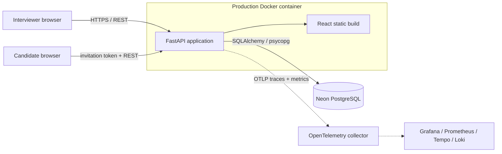

<div align="center">

# AI Interview Canvas

### A purpose-built collaborative workspace for system design interviews

[](https://ai-interview-canvas.onrender.com)
[](https://github.com/jmoriwa/ai_interview_canvas/actions/workflows/ci.yml)
[](backend/pyproject.toml)
[](frontend/package.json)

[Explore the live application](https://ai-interview-canvas.onrender.com) · [API contract](openapi.yaml) · [Product specification](docs/spec.md)

</div>

---

AI Interview Canvas—branded **DesignInterview** in the UI—replaces the patchwork of generic whiteboards, timers, notes, and evaluation forms used during system design interviews. An interviewer creates a structured session, shares a single invitation link, and collaborates with a candidate on an architecture canvas while private feedback remains isolated.

This is a production-deployed full-stack application, not a static prototype: it includes authenticated workflows, role-aware APIs, persistent PostgreSQL data, concurrent canvas synchronization, end-to-end browser tests, CI-gated deployments, and OpenTelemetry observability.

> **Try it:** open the [live deployment](https://ai-interview-canvas.onrender.com) and sign in with `alex@example.com` / `password123`. The free Render instance may need a short cold start.

## What it does

- **Interview lifecycle** — create, start, pause, complete, cancel, revisit, and filter interview sessions.
- **Candidate invitations** — share a session-scoped link; candidates join in a separate browser without an account or installation.
- **Architecture canvas** — place searchable system components, connect and label services, draw freehand, add notes and shapes, zoom, pan, undo, and redo.
- **Concurrent collaboration** — versioned documents autosave and synchronize every 250 ms; optimistic conflicts are merged and retried safely.
- **Interview controls** — use a server-authoritative timer, reveal follow-up questions progressively, manage participants, and lock candidate editing.
- **Private evaluation** — interviewer notes and a ten-dimension scorecard are stored behind role-aware endpoints and excluded from the candidate experience.
- **Persistent review** — retain the final diagram, observations, scores, and hiring recommendation for post-interview review.
- **Accessible presentation** — responsive layouts, keyboard-aware controls, semantic labels, and persistent light/dark themes.

## Engineering highlights

| Area | Implementation |
| --- | --- |
| Frontend | React 19, TypeScript, TanStack Router/Query, Vite, Tailwind CSS, Radix UI |
| Canvas | Custom React canvas workspace with components, connectors, strokes, viewport controls, and 60-step undo/redo history |
| Backend | FastAPI, Pydantic, SQLAlchemy 2, Argon2 password hashing, REST API defined in OpenAPI |
| Data | PostgreSQL in deployed/Compose environments; SQLite fallback for lightweight local development |
| Collaboration | Debounced optimistic writes, version checks, three-way collection merging, participant heartbeats, and role-based edit permissions |
| Observability | OpenTelemetry traces and metrics via OTLP; local Prometheus, Loki, Tempo, and Grafana stack with a provisioned activity dashboard |
| Delivery | Multi-stage Docker build, Render dev/production isolation, and CI-gated development deploys |
| Quality | Pytest unit/API tests, PostgreSQL integration tests, Playwright browser tests, and full Compose E2E collaboration tests |

## Architecture



The production image builds the React client with Node 22, installs the locked Python environment with `uv`, and serves both the static application and FastAPI API from one Uvicorn process on port `8000`. Keeping the artifact self-contained makes local, CI, and Render execution closely match.

## Run locally

### Full stack with Docker Compose

Prerequisites: Docker Desktop (or another Docker Engine) and ports `8000` and `5432` available.

```sh
docker compose up --build
```

Open [http://localhost:8000](http://localhost:8000). PostgreSQL data persists in the `interview-canvas-pgdata` named volume. Stop the stack with:

```sh
docker compose down
```

### Application container with SQLite

```sh
docker build -t ai-interview-canvas:local .
docker run --name ai-interview-canvas-local -p 8000:8000 \
  -e DATABASE_URL=sqlite:////app/data/designinterview.db \
  -v ai-interview-canvas-data:/app/data \
  ai-interview-canvas:local
```

The application is available at [http://localhost:8000](http://localhost:8000) and its health check at [http://localhost:8000/health](http://localhost:8000/health).

### Native development

Backend dependencies are managed with [`uv`](https://docs.astral.sh/uv/). Run these in separate terminals:

```powershell
cd backend
uv sync
uv run uvicorn app.main:app --reload
```

```powershell
cd frontend
npm ci
npm run dev
```

The frontend runs at `http://localhost:5173` and calls the API at `http://localhost:8000/api`.

## Test strategy

The CI pipeline deliberately tests at increasing levels of fidelity:

```sh
# Fast backend API tests
make test

# Browser tests against a real PostgreSQL service
cd frontend && npm run test:browser

# API integration tests against the complete Compose stack
make integration-test

# Multi-browser candidate/interviewer collaboration flow
make e2e-test
```

On pushes to `main` and pull requests, GitHub Actions runs backend and frontend jobs in parallel. After both pass, it builds the production Docker topology and executes Compose-backed integration and Playwright E2E tests. Failed E2E runs upload browser artifacts and container logs for diagnosis.

## Observability

The optional local telemetry environment includes an OpenTelemetry Collector, Prometheus, Loki, Tempo, and Grafana. It captures FastAPI request traces, standard HTTP metrics, and domain metrics for interview rooms, active participants, and canvas activity.

```powershell
docker compose -f observability/compose.yaml up -d
$env:GIT_COMMIT = git rev-parse HEAD
docker compose up --build -d
```

Open Grafana at [http://localhost:3001](http://localhost:3001) and select **AI Interview Canvas / Interview Activity**. See the [observability guide](observability/README.md) for configuration and teardown details.

## Deployment

Two independent Render web services use separate Neon PostgreSQL projects so development data and production data never cross boundaries.

| Environment | Service | Database | Release policy |
| --- | --- | --- | --- |
| Production | [`ai-interview-canvas`](https://ai-interview-canvas.onrender.com) | Neon production project | Manual, verified commit only |
| Development | `ai-interview-canvas-dev` | Neon development project | Automatic from `main` after CI passes |

Both services build the root [`Dockerfile`](Dockerfile), expose port `8000`, and use `/health` for health checks. Production has auto-deploy disabled; releases use **Manual Deploy → Deploy a specific commit** only after that commit passes CI and is verified in development.

Required service configuration:

```text
APP_ENV=<development|production>
DATABASE_URL=<environment-specific pooled Neon connection string>
```

OpenTelemetry is optional and activates when `OTEL_EXPORTER_OTLP_ENDPOINT` (or signal-specific trace/metric endpoints) is configured.

## Repository map

```text
ai_interview_canvas/
├── backend/           FastAPI application, persistence, telemetry, and tests
├── frontend/          React application and browser tests
├── e2e/               Compose-backed multi-browser Playwright tests
├── observability/     Collector and Grafana/Prometheus/Loki/Tempo stack
├── docs/              Product and technical specification
├── openapi.yaml       API contract
├── Dockerfile         Production multi-stage image
└── docker-compose.yaml
```

## Design decisions

- **Privacy at the API boundary:** interviewer notes and evaluations use authenticated owner-only endpoints; the candidate client does not receive those payloads.
- **Server-authoritative time:** session timing is derived from persisted start time plus accumulated seconds, preventing browser refreshes or clock drift from resetting the interview.
- **Conflict-aware synchronization:** canvas writes carry a document version. On a `409`, the client fetches the remote document, merges local changes by element ID, and retries once.
- **Environment parity:** the same Dockerfile is exercised by CI, local Compose, and Render, reducing deployment-only surprises.
- **Operational visibility:** application and domain telemetry can be enabled without coupling business logic to a specific monitoring vendor.

---

<div align="center">

Built as an end-to-end demonstration of product thinking, full-stack engineering, testing discipline, and production operations.

</div>
